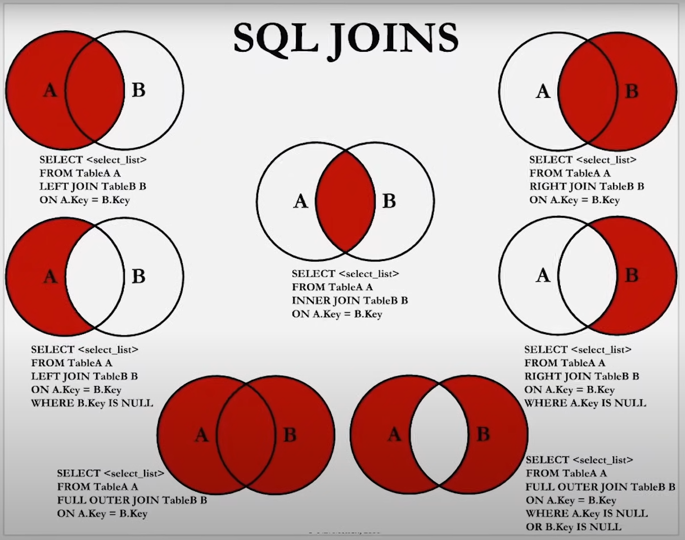

--joins - to combine something
-- it is used to query from two or more tables based on a related column between them
-- Types of join
-- inner join
-- left join, also called as left outer join
-- right join, also called as right outer join
-- full join, also called as full outer join

-- we hv two tables students and courses

+-------------------------+-------------+------+-----+-------------------+-------------------+
| Field                   | Type        | Null | Key | Default           | Extra             |
+-------------------------+-------------+------+-----+-------------------+-------------------+
| student_id              | int         | NO   | PRI | NULL              | auto_increment    |
| student_fname           | varchar(30) | NO   |     | NULL              |                   |
| student_lname           | varchar(30) | NO   |     | NULL              |                   |
| student_mname           | varchar(30) | YES  |     | NULL              |                   |
| student_email           | varchar(30) | NO   | UNI | NULL              |                   |
| student_phone           | varchar(15) | NO   |     | NULL              |                   |
| student_alternate_phone | varchar(15) | YES  |     | NULL              |                   |
| enrollment_date         | timestamp   | NO   |     | CURRENT_TIMESTAMP | DEFAULT_GENERATED |
| selected_course         | int         | NO   | MUL | 1                 |                   |
| years_of_exp            | int         | YES  |     | NULL              |                   |
| student_company         | varchar(30) | YES  |     | NULL              |                   |
| batch_date              | varchar(30) | NO   |     | NULL              |                   |
| source_of_joining       | varchar(30) | NO   |     | NULL              |                   |
| location                | varchar(30) | NO   |     | NULL              |                   |
+-------------------------+-------------+------+-----+-------------------+-------------------+

+------------------------+-------------+------+-----+---------+-------+
| Field                  | Type        | Null | Key | Default | Extra |
+------------------------+-------------+------+-----+---------+-------+
| course_id              | int         | NO   | PRI | NULL    |       |
| course_name            | varchar(30) | NO   |     | NULL    |       |
| course_duration_months | int         | NO   |     | NULL    |       |
| course_fee             | int         | NO   |     | NULL    |       |
+------------------------+-------------+------+-----+---------+-------+

-- if we need what is the name of course taken by rahul, we could use this query
select course_name from courses where course_id=(
select selected_course from students where student_fname='rahul'
);

-- what if we want this for each of the student, in that case join comes into the picture

select student_fname, student_lname,course_name from students join courses where selected_course=course_id;
select student_fname, student_lname,course_name from students join courses where students.selected_course=courses.course_id;

--both the above query will work
-- by default above query is inner join, only the matching records are considered, non matching records are discarded

-- inner join example
select column_name(s) from tableA inner join tableB on tableA.col_name= tableB.col_name;

-- left join
-- returns all records from the left table, and the matched records from the right table
select column_name(s) from tableA left join tableB on tableA.col_name=tableB.col_name;

-- right join
-- returns all records from the right table, and the matched records from the left table
select column_name(s) from tableA right join tableB on tableA.col_name=tableB.col_name;

-- full join
-- returns all the records when there is a match between either left or right table
select column_name(s) from tableA full outer join tableB on tableA.col_name=tableB.col_name;

