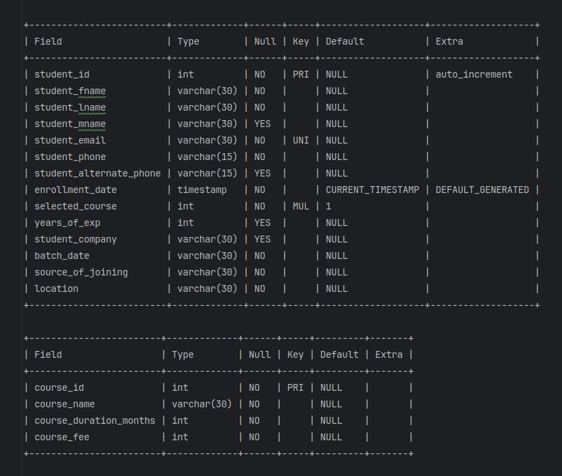
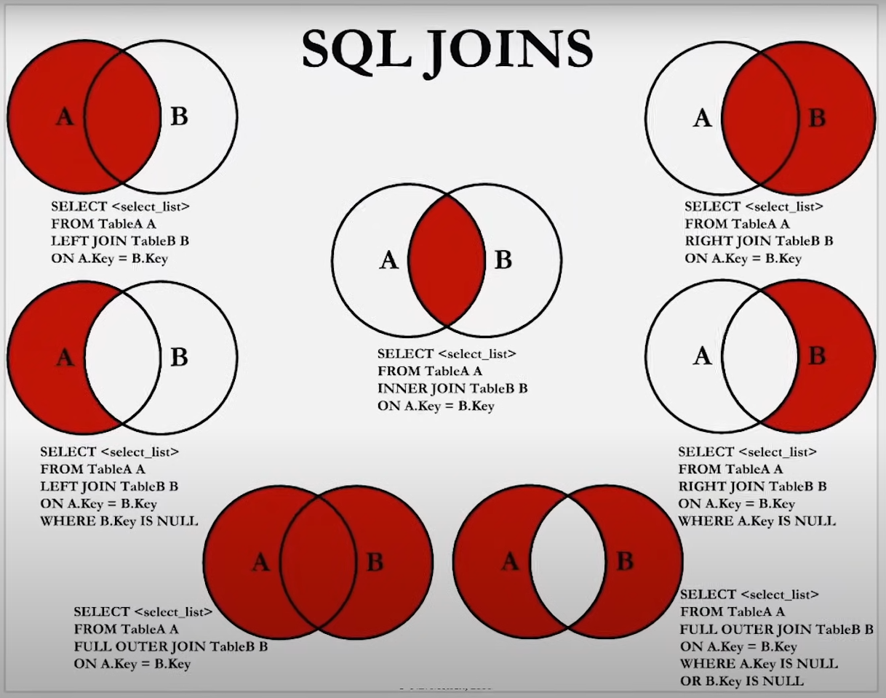

### Joins
- **Definition**: Joins are used to combine data from two or more tables based on a related column between them.
- **Purpose**: Joins allow you to query and retrieve data from multiple tables in a relational database.
- **Types of Joins**:
    - **Inner Join**
    - **Left Join** (also called Left Outer Join)
    - **Right Join** (also called Right Outer Join)
    - **Full Join** (also called Full Outer Join)

### Example Scenario
Suppose we have two tables, `students` and `courses`.



#### Simple Query
If you want to find out the name of the course taken by a student named Rahul, you could use this query:

```sql
SELECT course_name 
FROM courses 
WHERE course_id = (
    SELECT selected_course 
    FROM students 
    WHERE student_fname = 'rahul'
);
```

#### Using Joins
If you want to retrieve the course name for each student, you would use a join:

```sql
SELECT student_fname, student_lname, course_name 
FROM students 
JOIN courses ON students.selected_course = courses.course_id;
```

**Note**: Both of the following queries will work, and by default, these queries perform an inner join:

```sql
SELECT student_fname, student_lname, course_name 
FROM students 
JOIN courses ON selected_course = course_id;
```

```sql
SELECT student_fname, student_lname, course_name 
FROM students 
JOIN courses ON students.selected_course = courses.course_id;
```

### Inner Join
- **Definition**: The inner join returns only the matching records between the two tables. Non-matching records are discarded.

**Syntax**:
```sql
SELECT column_name(s) 
FROM tableA 
INNER JOIN tableB ON tableA.col_name = tableB.col_name;
```

### Left Join
- **Definition**: The left join returns all records from the left table and the matched records from the right table. If no match is found, NULL values are returned for columns from the right table.

**Syntax**:
```sql
SELECT column_name(s) 
FROM tableA 
LEFT JOIN tableB ON tableA.col_name = tableB.col_name;
```

### Right Join
- **Definition**: The right join returns all records from the right table and the matched records from the left table. If no match is found, NULL values are returned for columns from the left table.

**Syntax**:
```sql
SELECT column_name(s) 
FROM tableA 
RIGHT JOIN tableB ON tableA.col_name = tableB.col_name;
```

### Full Join
- **Definition**: The full join returns all records when there is a match between the left or right table. If there is no match, NULL values are returned for the columns where there is no match.

**Syntax**:
```sql
SELECT column_name(s) 
FROM tableA 
FULL OUTER JOIN tableB ON tableA.col_name = tableB.col_name;
```
