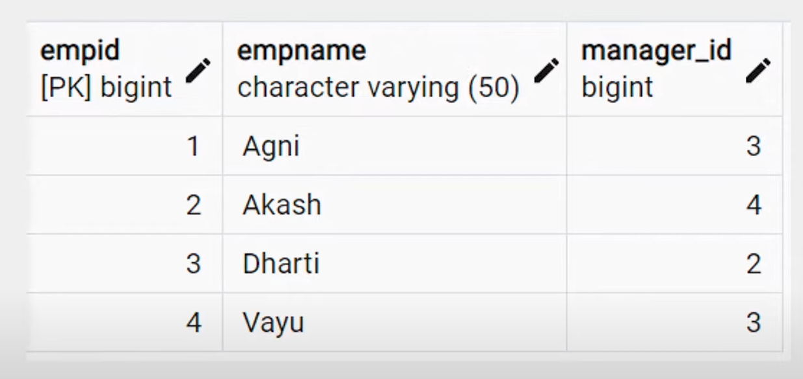

### Self Join
- **Definition**: A self join is a regular join where a table is joined with itself.
- **Purpose**: Self joins are powerful for comparing values in different rows within the same table.

**Syntax**:
```sql
SELECT column_name(s) 
FROM table AS T1 
JOIN table AS T2 ON T1.col_name = T2.col_name;
```


**Example**:
```sql
SELECT T1.empName, T2.empName 
FROM emp AS T1 
JOIN emp AS T2 ON T1.manager_id = T2.empid;
```

---

### Union
- **Definition**: The SQL `UNION` clause/operator is used to combine or concatenate the results of two or more `SELECT` statements, ensuring no duplicate rows are returned.
- **Requirements**:
    - Each `SELECT` statement must have the same number of columns.
    - The data types of the columns must match.
    - The columns must be in the same order.

**Syntax**:
```sql
SELECT column_name(s) 
FROM tableA 
UNION 
SELECT column_name(s) 
FROM tableB;
```

**Example**:
```sql
SELECT cust_name, cust_amount 
FROM custA 
UNION 
SELECT cust_name, cust_amount 
FROM custB;
```

---

### Union All
- **Definition**: Similar to `UNION`, the `UNION ALL` operator combines the results of two or more `SELECT` statements. However, unlike `UNION`, `UNION ALL` does not remove duplicate rows.
- **Usage**: Use `UNION ALL` when you want to keep all records, including duplicates.

**Syntax**:
```sql
SELECT column_name(s) 
FROM tableA 
UNION ALL 
SELECT column_name(s) 
FROM tableB;
```

**Example**:
```sql
SELECT cust_name, cust_amount 
FROM custA 
UNION ALL 
SELECT cust_name, cust_amount 
FROM custB;
```

