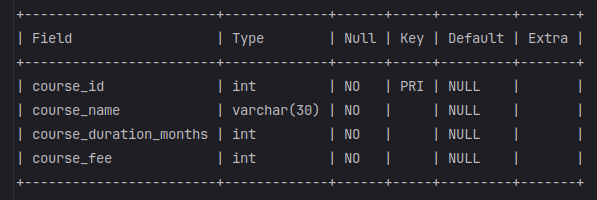

### Different Data Types

**Issue with Integer Data Type**:
- **Problem**: If a column with an `INT` data type is used to store decimal values, the system will round off the decimal portion.



**Example Table Structure**:
```sql
DESC courses;
-- Assuming the table structure includes course_duration_months as INT
```

**Example Insert Statement**:
```sql
INSERT INTO courses VALUES (5, 'data structure', 4.5, 15000);
```
- **Outcome**: The value `4.5` will be rounded to `5` because the column `course_duration_months` is of type `INT`.

**Correct Approach with Decimal Data Type**:
- **Definition**: Use the `DECIMAL` data type to store precise decimal values. For example, `DECIMAL(6,2)` allows for up to 6 digits in total, with 2 digits after the decimal point.

**Example Table Structure**:
```sql
CREATE TABLE courses_new (
    course_id INT NOT NULL,
    course_name VARCHAR(30) NOT NULL,
    course_duration_months DECIMAL(3,1) NOT NULL, -- Up to 3 digits, 1 after the decimal point
    course_fee INT NOT NULL,
    PRIMARY KEY (course_id)
);
```

**Example Insert Statement**:
```sql
INSERT INTO courses_new (course_id, course_name, course_duration_months, course_fee) 
VALUES
(1, 'big data', 6.5, 50000),
(2, 'web development', 3.5, 20000),
(3, 'data science', 6, 40000),
(4, 'devops', 1, 10000);
```

---

### Adding and Updating Timestamp Columns

**Adding a Timestamp Column with Default Value**:
- **Definition**: You can add a column with a default timestamp value to track when a record was created or updated.

**Example Table Structure**:
```sql
CREATE TABLE courses_new (
    course_id INT NOT NULL,
    course_name VARCHAR(30) NOT NULL,
    course_duration_months DECIMAL(3,1) NOT NULL,
    course_fee INT NOT NULL,
    changed_at TIMESTAMP DEFAULT CURRENT_TIMESTAMP, -- Default to current timestamp
    PRIMARY KEY (course_id)
);
```

**Insert Statement**:
```sql
INSERT INTO courses_new (course_id, course_name, course_duration_months, course_fee) 
VALUES
(1, 'big data', 6.5, 50000),
(2, 'web development', 3.5, 20000),
(3, 'data science', 6, 40000),
(4, 'devops', 1, 10000);
```

**Updating Timestamp Column on Change**:
- **Definition**: Use `ON UPDATE CURRENT_TIMESTAMP` to automatically update the timestamp column whenever the row is modified.

**Example Table Structure**:
```sql
CREATE TABLE courses_new (
    course_id INT NOT NULL,
    course_name VARCHAR(30) NOT NULL,
    course_duration_months DECIMAL(3,1) NOT NULL,
    course_fee INT NOT NULL,
    changed_at TIMESTAMP DEFAULT CURRENT_TIMESTAMP ON UPDATE CURRENT_TIMESTAMP,
    PRIMARY KEY (course_id)
);
```

**Alternative Using `NOW()` Function**:
- **Definition**: `NOW()` is a function that returns the current date and time, similar to `CURRENT_TIMESTAMP`.

**Example Table Structure**:
```sql
CREATE TABLE courses_new (
    course_id INT NOT NULL,
    course_name VARCHAR(30) NOT NULL,
    course_duration_months DECIMAL(3,1) NOT NULL,
    course_fee INT NOT NULL,
    changed_at TIMESTAMP DEFAULT NOW() ON UPDATE NOW(),
    PRIMARY KEY (course_id)
);
```